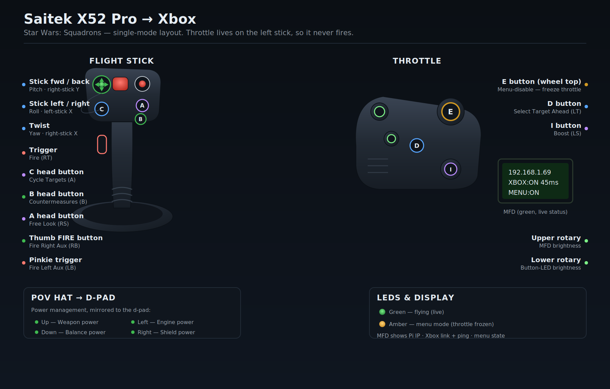

# HOTAS Bridge — Saitek X52 → Xbox Series X (Oberon mode)

Use your Saitek X52 / X52 Pro on an Xbox Series X, wirelessly, with one Orange
Pi Zero 3. The Pi reads the stick and sends its inputs to the **Oberon Remote**
app on the Xbox, which injects them as a controller. No USB proxy, no second
board, no soldering.

```
X52 --USB--> Orange Pi Zero 3 --WiFi--> Oberon app on Xbox --> game
```

---

## Layout (Star Wars: Squadrons)



Single mode — the mode dial position doesn't matter, all layers are identical.
The throttle sits on the left stick, so it never fires the weapon.

| Xbox | HOTAS control | Squadrons function |
|------|---------------|--------------------|
| Left stick Y | Stick forward/back | Pitch |
| Left stick X | Stick left/right | Roll |
| Right stick X | Twist | Yaw |
| Left stick Y | Throttle lever | Throttle (up = forward) |
| RT | Main trigger | Fire |
| RB | Thumb FIRE button | Fire Right Auxiliary |
| LB | Pinkie trigger | Fire Left Auxiliary |
| A | C head button | Cycle Targets |
| B | B head button | Deploy Countermeasures |
| RS | A head button | Free Look |
| LT | D button (throttle) | Select Target Ahead |
| LS | I button (throttle) | Boost |
| Menu | T1 rocker | Menu |
| View | T2 rocker | Show Loadout |
| D-pad | POV hat | Power: up=weapon, left=engine, down=balance, right=shields |
| — | E button (throttle) | Menu-disable: freezes the throttle for menus/radials |

---

## What you need

- Saitek X52 or X52 Pro
- Orange Pi Zero 3 running Armbian, on the same WiFi as the Xbox
- Xbox Series X|S
- The free **Oberon Remote Input** app on the Xbox (Microsoft Store, retail
  mode is fine — no Dev Mode needed)

---

## Throttle display (X52 Pro MFD)

The X52 Pro's throttle screen can show live bridge status: the Pi's IP, whether
the Xbox (Oberon) is connected, the poll ping in ms, and whether menu mode is on.
This is optional and needs the **libx52** driver
(https://github.com/nirenjan/libx52), which provides the `x52cli` command.

**The installer sets this up for you.** When you run `sudo ./install.sh oberon`
it offers to install libx52; answer yes and the throttle screen just works. To
install without being asked, pass `MFD=yes sudo -E ./install.sh oberon`; to skip
it, `MFD=no`.

If you'd rather add it by hand (or later):

```bash
sudo apt-add-repository ppa:nirenjan/libx52
sudo apt update
sudo apt install x52pro-linux
sudo systemctl restart hotas-oberon
```

The server auto-detects `x52cli` on startup and begins writing the display; if
it isn't installed, the bridge runs exactly the same without it. The screen
shows:

```
192.168.1.69          <- Pi IP (enter this in the Oberon app)
XBOX:ON    45ms       <- Oberon connected + poll ping
MENU:ON               <- menu mode (throttle frozen) on/off
```

`XBOX:-- waiting` means Oberon hasn't connected yet. `MENU` flips as you press
the menu-disable button.

---

## Setup

### 1. Install Oberon on the Xbox

Microsoft Store, search **"Oberon Remote Input"** (by SamsidParty), install.
Don't open it yet.

### 2. Copy this folder to the Pi and install

```bash
# copy the hotas-bridge folder to the Pi, then:
cd hotas-bridge
sudo ./install.sh oberon
```

That installs dependencies and a service that starts on boot.

### 3. Calibrate to your stick (recommended)

X52 and X52 Pro report their axes under different codes. Instead of guessing,
run the wizard once. It detects your real axes, learns their ranges, skips any
axis that jitters on its own, and lets you pick your menu-suspend button:

```bash
sudo python3 /opt/hotas-bridge/oberon/calibrate.py --game squadrons
```

Follow the prompts: move the stick left/right, then forward/back, then twist,
then the throttle, then press the button you want as the menu-suspend toggle.
It writes `sender/sender_config.calibrated.json`. Make it your active config:

```bash
cp /opt/hotas-bridge/sender/sender_config.calibrated.json \
   /opt/hotas-bridge/sender/sender_config.json
sudo systemctl restart hotas-oberon
```

### 4. Connect

On the Xbox, open **Oberon Remote**, enter the Pi's IP address (printed when the
server starts, or check your router), and press **Connect**. Open your game and
fly.

---

## The throttle-scrolls-menus fix (important)

On the **Xbox dashboard**, the right trigger scrolls lists. The throttle is
mapped to the right trigger (correct for flying), so a raised throttle scrolls
the dashboard and you can't navigate. This only happens in menus. In the game
itself the throttle works perfectly.

**Fix: start in menu mode.** Axes boot frozen, so nothing scrolls. Navigate with
the hat and buttons, launch your game, then press your suspend button once to
start flying. Press it again whenever you need a menu.

```bash
sudo python3 /opt/hotas-bridge/oberon/oberon_server.py --menu
```

To make it automatic, add `--menu` to the service:

```bash
sudo nano /etc/systemd/system/hotas-oberon.service
#   ExecStart=... oberon_server.py --config .../sender_config.json --menu
sudo systemctl daemon-reload && sudo systemctl restart hotas-oberon
```

Your suspend button is set by the calibration wizard (or the `suspend_button`
field in the config). Find any button's name with:

```bash
sudo python3 /opt/hotas-bridge/oberon/oberon_server.py --probe
```

---

## In-game (Star Wars: Squadrons)

Bind the throttle once: **Options > Controls > Throttle axis > Right Trigger**
(choose Absolute if asked). Power management (engines/weapons/shields) is on the
d-pad, which the config drives from the POV hat. Roll is on the twist axis.

For MSFS 2024, use the ready-made profile:

```bash
sudo python3 /opt/hotas-bridge/oberon/oberon_server.py \
    --config /opt/hotas-bridge/sender/profiles/sender_config.msfs2024.json --menu
```

---

## Adjusting the mapping

Everything lives in `sender/sender_config.json`:

- **`axes`** — maps an evdev axis code to an Xbox target (`lx ly rx ry lt rt`).
  `invert` flips it, `deadzone` (0-1) kills centre drift, `expo` (0-1) softens
  the middle of the throw.
- **`buttons`** — three layers (`mode1/2/3`) selected by the X52 mode switch.
  Targets: `a b x y lb rb ls rs view menu dpad_up dpad_down dpad_left
  dpad_right`, plus `select_mode1/2/3` for the mode switch.
- **`suspend_button`** — the button that freezes/unfreezes axes for menus.
- **`hat_to_dpad`** — POV hat drives the d-pad when true.

After any edit, restart the service so it reloads:

```bash
sudo systemctl restart hotas-oberon
```

---

## Troubleshooting

**Throttle still scrolls the dashboard.** You're not in menu mode, or the
service is running old code. Start with `--menu`, and after any change run
`sudo systemctl restart hotas-oberon`.

**A control does the wrong thing / wrong axis.** Your stick's codes don't match
the config. Re-run the calibration wizard.

**Xbox won't connect.** Pi and Xbox must be on the same network. Re-enter the
Pi's IP in the Oberon app. Confirm the server is running:
`systemctl status hotas-oberon`.

**Inputs feel laggy.** Put the Pi and Xbox on 5 GHz if possible, and keep them
near the router.

**A game rejects the input.** Oberon injects a synthetic controller; a few apps
block that. Squadrons and MSFS 2024 work. There's no fix if a specific game
blocks it.

---

## Files

```
hotas-bridge/
├── install.sh                     one-shot installer (sudo ./install.sh oberon)
├── oberon/
│   ├── oberon_server.py           the server: reads X52, talks to Oberon
│   ├── mfd.py                     optional X52 Pro throttle-screen status (libx52)
│   ├── calibrate.py               calibration wizard (detects axes + buttons)
│   └── hotas-oberon.service       starts the server on boot
└── sender/
    ├── sender_config.json         your active config (Squadrons by default)
    └── profiles/
        ├── sender_config.squadrons.json
        └── sender_config.msfs2024.json
```

The `proxy/`, `receiver/`, `tools/`, and `overlays/` folders belong to an
alternative USB-hardware mode and aren't needed for Oberon.
